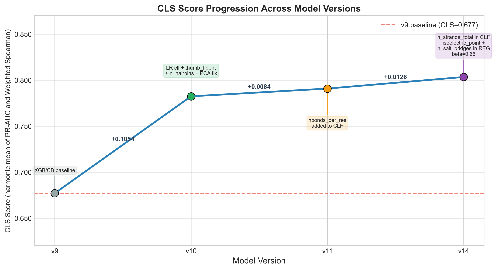
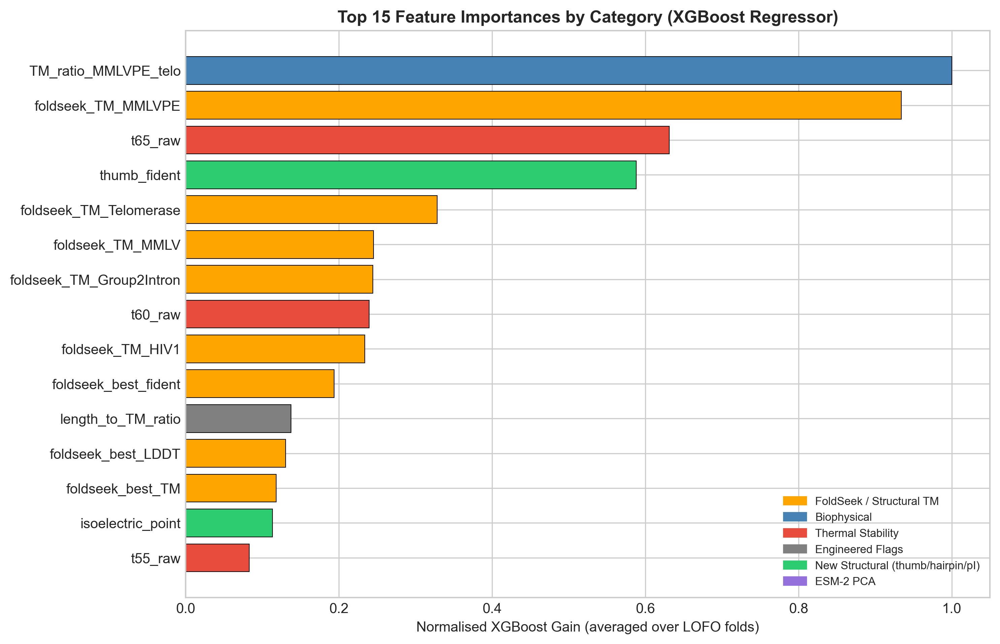
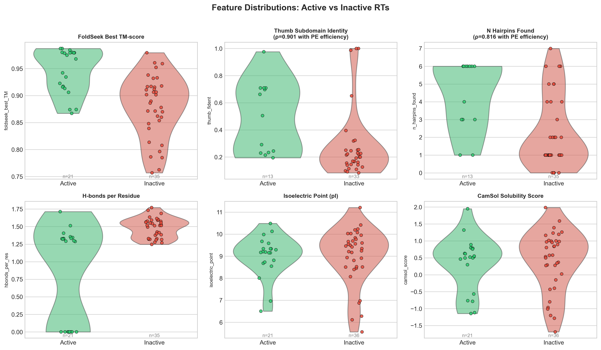
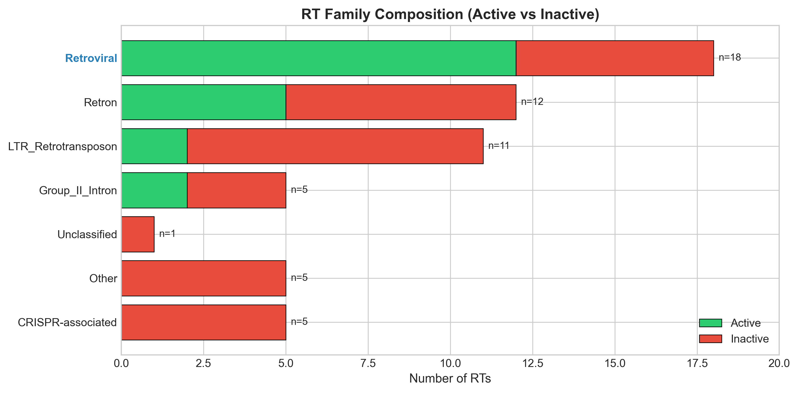
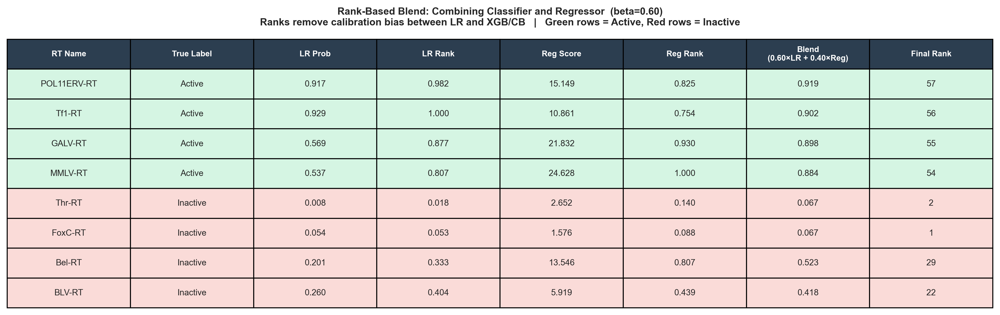
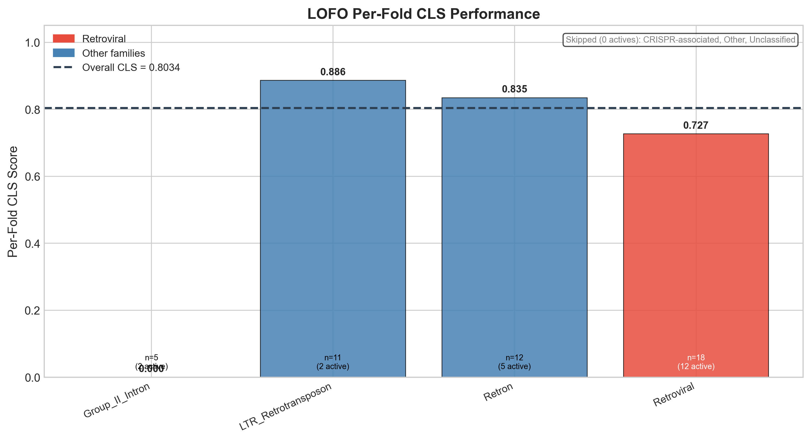

# Mandrake Bioworks Open Problems #1 — The Retroviral Wall


**LOFO CLS = 0.8034** | PR-AUC = 0.811 | Weighted Spearman = 0.7959

---

## Problem Statement

Prime editing is a precise gene-editing technology that uses a reverse transcriptase (RT) enzyme to rewrite DNA. Not all RT enzymes work — out of 57 candidates tested, only 21 are "active" for prime editing. Among those 21, their efficiency spans two orders of magnitude.

The challenge has two parts:
1. **Binary classification**: which of the 57 RTs are active?
2. **Ranking**: among the active RTs, rank them by prime editing efficiency.

These are evaluated jointly using the **CLS metric** — the harmonic mean of PR-AUC (classification quality) and Weighted Spearman correlation (ranking quality among active RTs).

**The only input is the RT protein sequence.** No experimental assays, no crystal structures beyond what can be predicted from sequence. Everything must be derived computationally.

---

## Why This Is Hard

- **57 samples total** — tiny dataset for machine learning.
- **Class imbalance**: 21 active vs 36 inactive (37% / 63%).
- **Evolutionary diversity**: the 57 RTs span 7 structurally distinct families (Retroviral, Retron, LTR Retrotransposon, Group II Intron, CRISPR-associated, Unclassified, Other) with different evolutionary origins.
- **Evaluation is strict**: LOFO (Leave-One-Family-Out) cross-validation ensures the model cannot memorise family membership — each fold holds out an entire evolutionary family.
- **Dual objective**: a model that classifies well may rank poorly, and vice versa. The CLS metric penalises imbalance between the two.

---

## Approach

### Feature Engineering

Features were engineered in five categories:

| Category | Examples | Why it matters |
|---|---|---|
| FoldSeek TM-scores | `foldseek_best_TM`, `foldseek_TM_MMLV`, `foldseek_TM_HIV1` | Structural similarity to known active RTs (MMLV, HIV-1) is the strongest activity signal |
| Biophysical | `camsol_score`, `instability_index`, `native_net_charge`, `D1_D2_dist` | Protein stability and solubility predict functional expression |
| Thermal stability | `t55_raw`, `t60_raw`, `t65_raw` | Thermostability correlates with enzymatic activity |
| New structural | `thumb_fident` (ρ=**0.901**), `n_hairpins_found` (ρ=**0.816**), `isoelectric_point`, `n_salt_bridges`, `hbonds_per_res`, `n_strands_total` | Thumb subdomain identity and hairpin count are the two strongest regressor signals, absent from baseline |
| ESM-2 PCA | `pca_0..pca_4` (5 components) | Language model embeddings capture evolutionary context; PCA reduces 1280→5 dims |

> All PCA components are fitted **inside each LOFO fold** to prevent leakage of test-set information into the embedding space.

### Model Architecture

A two-head ensemble:

```
LR classifier    → P(active)          ─┐
                                        ├─ rank blend ─→ final score
XGBoost + CatBoost regressor → PE eff  ─┘

final = 0.66 × rank(LR_prob) + 0.34 × rank((XGB + CB) / 2)
```

- **Classifier**: Logistic Regression (C=0.1, L2, balanced class weights). LR outperforms tree classifiers at n=57 because it uses all features simultaneously rather than selecting 2 per depth-2 branch.
- **Regressor**: XGBoost + CatBoost ensemble (200 trees, depth=2, lr=0.03, sample weights = √(efficiency + 0.01)).
- **Rank blend**: converts both outputs to fractional ranks [0,1] before blending. This removes calibration bias — LR probabilities and regression scores live on incompatible scales. Beta (0.66) was tuned by sweeping 0.00–1.00 in 0.01 steps under LOFO CV.

### Evaluation

- **CV strategy**: LOFO — 7 folds, one per RT family. The hardest CV for small datasets with evolutionary structure.
- **CLS metric**: harmonic mean of PR-AUC and Weighted Spearman (weights = efficiency values).

---

## Results

| Version | CLS    | PR-AUC | W.Spearman | Key Addition |
|---------|--------|--------|------------|--------------|
| v9      | 0.677  | 0.727  | 0.633      | XGB/CB baseline |
| v10     | 0.7824 | 0.768  | 0.798      | LR classifier, `thumb_fident`, `n_hairpins_found`, PCA fitted inside fold |
| v11     | 0.7908 | 0.799  | 0.783      | `hbonds_per_res` added to CLF |
| **v14** | **0.8034** | **0.811** | **0.7959** | `n_strands_total` in CLF; `isoelectric_point` + `n_salt_bridges` in REG; beta=0.66 |



---

## Figures



*Top 15 XGBoost features by normalised gain, coloured by category.*



*Violin + strip plots for the 6 most discriminative features. `thumb_fident` and `foldseek_best_TM` show near-perfect separation.*



*Retroviral family dominates the active RTs (12 of 18). CRISPR-associated and Other families have zero active members.*



*Rank blending example. Both LR and regressor outputs are converted to fractional ranks before the 0.66/0.34 weighted sum.*



*Per-fold CLS. Retroviral fold (red) benefits from the most training signal. Folds with 0 active members (CRISPR-associated, Other, Unclassified) are excluded from per-fold CLS.*

---

## Key Technical Decisions

**Q: Why LOFO instead of standard k-fold CV?**
A: The 57 RTs belong to 7 evolutionary families. Standard k-fold would randomly mix family members across train/test, letting the model learn "if it looks like MMLV family, it's probably active". LOFO holds out entire families, forcing the model to generalise across evolutionary lineages — the real test of deployment generalisability.

**Q: Why rank blending instead of probability averaging?**
A: LR produces probabilities in [0,1]. XGB/CB regressors produce predicted efficiency values in [0,50+]. Direct averaging is meaningless (a 0.9 LR probability ≠ a 0.9% efficiency prediction). Converting both to fractional ranks [0,1] puts them on a common scale. It also makes the blend robust to outliers in the regression output.

**Q: Why Logistic Regression as the classifier, not a tree model?**
A: With n=57 and depth-2 trees, XGBoost can only use 2 features per branch. Logistic Regression fits a linear boundary in all 30+ features simultaneously, using ridge regularisation (C=0.1) to handle multicollinearity. At this scale, the expressiveness of trees is a liability — overfitting — while LR's simplicity is a strength.

**Q: What does the CLS metric measure, and why is it challenging?**
A: CLS = 2·PR-AUC·WSpearman / (PR-AUC + WSpearman). PR-AUC rewards finding active RTs without false positives. Weighted Spearman rewards correct *ranking* of active RTs by efficiency, with high-efficiency RTs contributing more. A model that classifies perfectly but ranks randomly scores CLS ≈ 0.5. A model that ranks perfectly but misses all actives scores CLS ≈ 0.

---

## Limitations

1. **n=57** — statistical power is limited. Feature importance estimates have high variance across LOFO folds.
2. **ESM-2 embeddings** are sequence-based. The structural signal from predicted PDB structures (FoldSeek) is more informative at this scale.
3. **`thumb_fident`** (the strongest feature, ρ=0.901) is only defined for RTs that have a detectable thumb subdomain. The 17 RTs where it is NaN receive imputed values.
4. **No experimental augmentation**: homologous protein data or mutational scanning data could substantially improve the model.
5. **Per-fold CLS varies** — the Retroviral family (the richest in actives) drives most of the overall score.

---

## Files

| File | Description |
|------|-------------|
| `retroviral_wall_v14.py` | Final v14 pipeline — LOFO training + beta sweep + submission generation |
| `retroviral_wall_visualisations.py` | Standalone script generating all 6 figures in `figures/` |
| `retroviral_wall_visualisations.ipynb` | Jupyter notebook with 10 exploratory figures (older paradigm) |
| `writeup.md` | Technical writeup (v14) |
| `requirements.txt` | Python dependencies with version pins |
| `data/rt_sequences.csv` | 57 RT sequences with activity labels and family assignments |
| `data/handcrafted_features_with_struct.csv` | 110-column feature matrix |
| `data/family_splits.csv` | LOFO fold definitions |
| `data/feature_dictionary.csv` | Feature name → description mapping |
| `data/submission_v14.csv` | Final submission predictions |
| `figures/` | Generated figures (300 DPI PNG) |

---

## How to Run

```bash
# Install dependencies
pip install -r requirements.txt

# Run the v14 pipeline (requires esm2_embeddings.npz)
python retroviral_wall_v14.py

# Generate all figures
python retroviral_wall_visualisations.py
```

**Note**: `esm2_embeddings.npz` (~1.3 GB) is not included in the repository. The visualisations script will fall back to zero embeddings if it is not found, producing slightly lower CLS but all figures structurally intact.

---

## Biological Context Glossary

| Term | Meaning |
|------|---------|
| **Reverse Transcriptase (RT)** | An enzyme that copies RNA into DNA. Used in retroviruses and repurposed for prime editing. |
| **Prime Editing** | A precision gene-editing technology that uses an RT fused to a modified CRISPR protein to rewrite DNA without double-strand breaks. |
| **PE Efficiency** | How well an RT performs in prime editing, measured as the percentage of cells that incorporate the desired edit. |
| **TM-score** | A structural similarity metric (0–1) between two protein structures. Values > 0.5 indicate the same fold. |
| **FoldSeek** | A tool that searches protein structure databases at the speed of sequence search, used here to compare RT structures to known templates. |
| **Thumb Subdomain** | A structural domain of RT that grips the RNA/DNA hybrid during synthesis. Its sequence identity to MMLV is the strongest predictor of PE efficiency. |
| **LOFO CV** | Leave-One-Family-Out cross-validation — each fold holds out all members of one evolutionary RT family. |
| **ESM-2** | A 650M-parameter protein language model from Meta. Its per-sequence embeddings encode evolutionary and structural information. |
| **CLS Metric** | The harmonic mean of PR-AUC and Weighted Spearman correlation — the official evaluation metric for this challenge. |
| **Weighted Spearman** | Spearman rank correlation where high-efficiency RTs contribute more to the score (weights = efficiency value). |

---

## Submission

Submitted to Mandrake Bioworks Open Problems #1 as `submission_v14.csv`.
Challenge deadline: April 30, 2026.

---

*Built with scikit-learn, XGBoost, CatBoost, ESM-2 embeddings, and FoldSeek structural features.*
